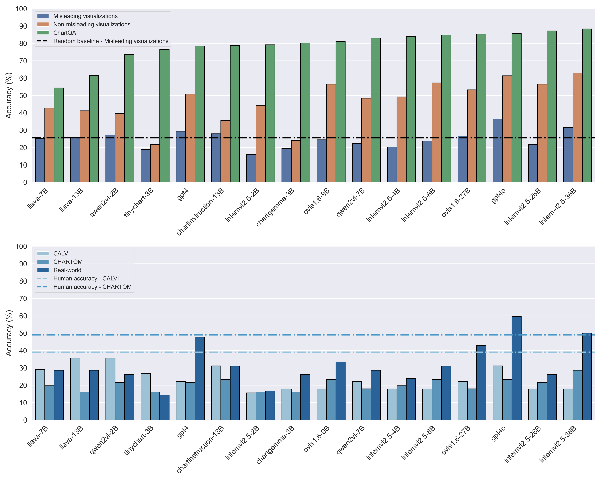

# Protecting MLLMs against misleading visualizations

[](https://opensource.org/licenses/Apache-2.0)
[](https://www.python.org/)

This repository contains the implementation of the arxiv preprint: Protecting Multimodal LLMs against misleading visualizations. The code is released under an **Apache 2.0** license.

Contact person: [Jonathan Tonglet](mailto:jonathan.tonglet@tu-darmstadt.de) 

[UKP Lab](https://www.ukp.tu-darmstadt.de/) | [TU Darmstadt](https://www.tu-darmstadt.de/)

Don't hesitate to send us an e-mail or report an issue, if something is broken (and it shouldn't be) or if you have further questions. 


## Abstract 

> We assess the vulnerability of multimodal large language models to misleading visualizations - charts that distort the underlying data  using techniques such as truncated or inverted axes, leading readers to draw inaccurate conclusions that may support misinformation or conspiracy theories. Our analysis shows that these distortions severely harm multimodal large language models, reducing their question-answering accuracy by up to 34.8 percentage points compared to non-misleading visualizations and lowering it to the level of the random baseline. To mitigate this vulnerability, we introduce six inference-time methods to improve performance of MLLMs on misleading visualizations while preserving their accuracy on non-misleading ones. The most effective approach involves (1) extracting the underlying data table and (2) using a text-only large language model to answer questions based on the table. This method improves performance on misleading visualizations by 15.4 to 19.6 percentage points.

## tl;dr

- Misleading visualizations are **charts that distort the underlying data**, leading readers to inaccurate interpretations 📊
  - Distortions include truncated and inverted axes, 3D effects, or inconsistent tick intervals
  - Misleading negatively affect the performance of human readers in QA tasks. What about MLLMs?
- MLLMs **are very vulnerable** to misleading visualizations too ⚠️
  - their QA performance drops to the level of the random baseline 
  - up to 65.5 percentage points decrease in accuracy compared to non-misleading visualization datasets like ChartQA
 
<p align="center">
  
</p>

- We propose **six inference-time correction methods** to improve performance on misleading visualizations 🛠️
  - the best method is to extract the table using the MLLM, then answer with a LLM using the table only
  - this improves performance by up to 19.6 percentage points

<p align="center">
  
</p>

## Environment

Follow these instructions to recreate the environment used for all our experiments.

```
$ conda create --name misviz python=3.9
$ conda activate misviz
$ pip install -r requirements.txt
```

## Datasets

<p align="center">
  
</p>


- CALVI
  - dataset introduced by Get el. (2023) in "[CALVI: Critical Thinking Assessment for Literacy in Visualizations](https://dl.acm.org/doi/10.1145/3544548.3581406)".
  - Ready to use 
  - License: CC-BY 4.0

- Real-world
  - dataset introduced in this work, based on visualizations collected by Lo et al. (2022) in "[Misinformed by visualization: What do we learn from misinformative visualizations?](https://onlinelibrary.wiley.com/doi/abs/10.1111/cgf.14559)"
  - Images should be downloaded using the script below
  - License for the QA pairs: CC-BY-SA 4.0

- CHARTOM
  - dataset introduced by Bharti et al. (2024) in "[CHARTOM: A Visual Theory-of-Mind Benchmark for Multimodal Large Language Models](https://arxiv.org/abs/2408.14419v1)"
  - Please contact the authors to get access to the dataset. Then, run the script below to process the dataset.

- VLAT 
  - dataset introduced by Lee et al. (2017) in "[VLAT: Development of a Visualization Literacy Assessment Test](https://ieeexplore.ieee.org/abstract/document/7539634)"
  - Ready to use


The following script will prepare the datasets, including downloading the real-world images.

```
$ python src/dataset_preparation.py
```


## Quick start

The following code lets you evaluate the performance of MLLMs on misleading and non-misleading visualizations, with or without one of the six correction methods proposed in the paper.
Some correction methods require intermediate steps like extracting the axes or table, or redrawing the visualization.

<p align="center">
  
</p>

### Evaluate a multimodal LLM on one or more dataset

```
$ python src/question_answering.py --datasets calvi-chartom-real_world-vlat --model internvl2.5/8B/
```

The ```--datasets``` argument expects  a string of dataset names separated by  ```-```. By default, available datasets are  ```calvi```, ```chartom```, ```real_world```, and ```vlat```.

The ```--model``` argument expects a string in the format ```model_name/model_size/```. By default, the following models are available:

| Name     | Available sizes | 🤗 models   |
| :---: | :---: | :---: |
| internvl2.5    |  2B, 4B, 8B, 26B, 38B | [Link](https://huggingface.co/collections/OpenGVLab/internvl25-673e1019b66e2218f68d7c1c) |
| ovis 1.6  | 9B, 27B | [Link](https://huggingface.co/collections/AIDC-AI/ovis2-67ab36c7e497429034874464) |
| llava-v1.6-vicuna | 7B, 13B | [Link](https://huggingface.co/collections/llava-hf/llava-next-65f75c4afac77fd37dbbe6cf) |
| qwen2vl      | 2B, 7B   | [Link](https://huggingface.co/collections/Qwen/qwen2-vl-66cee7455501d7126940800d)  |
| chartinstruction | 13B | [Link](https://huggingface.co/lewy666/llava-hr-ChartInstruction)  |
| chartgemma | 3B | [Link](https://huggingface.co/ahmed-masry/chartgemma) |
| tinychart | 3B | [Link](https://huggingface.co/mPLUG/TinyChart-3B-768)  |


If you want to use **TinyChart**: you need to copy [this folder](https://github.com/X-PLUG/mPLUG-DocOwl/tree/main/TinyChart/tinychart) and place it in the root folder of this repo

If you want to use **ChartInstruction**: you need to copy [this folder](https://github.com/zengxingchen/ChartQA-MLLM/tree/main/model/llava_hr) and place it in the root folder of this repo


### Generate metadata (table, axis)

```
$ python src/chart2metadata.py --datasets calvi-chartom-real_world-vlat --model internvl2.5/8B/
```


### Redraw a visualization based on the extracted table

```
$ python src/table2code.py --datasets calvi-chartom-real_world-vlat --model qwen2.5/7B/
```


### Evaluation

Finally, evaluate the accuracy of the models

```
$ python src/evaluate.py --results_folder results_qa --output_file results_qa.csv
```


## Citation

If you find this work relevant to your research or use this code in your work, please cite our paper as follows:

```bibtex 
@article{tonglet2025misleadingvisualizations,
  title={Protecting multimodal LLMs against misleading visualizations},
  author={Tonglet, Jonathan and Tuytelaars, Tinne and Moens, Marie-Francine and Gurevych, Iryna},
  journal={arXiv preprint arXiv:2502.XXXX},
  year={2025}
}
```


## Disclaimer

> This repository contains experimental software and is published for the sole purpose of giving additional background details on the respective publication.
